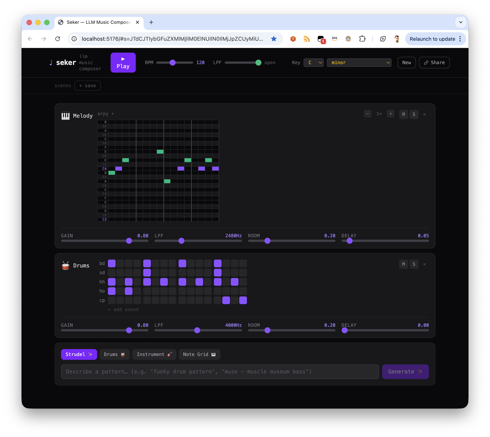

# Seker

**LLM-powered browser music composer.** Describe a pattern in plain English → Claude generates [Strudel](https://strudel.cc) code → layers stack into a live DAW-style session.



---

## Features

- **Natural language → music** — type *"funky drum pattern"* or *"jazzy bass line"*, Claude generates runnable Strudel code instantly
- **DAW-style lanes** — each generated pattern lives in its own lane with mute, solo, and delete controls
- **Live parameter control** — per-lane gain, low-pass filter, reverb, and delay sliders re-evaluate in real time (~80ms debounce)
- **Editable prompts** — click the `↺` prompt on any lane, edit the description, hit Regenerate to get a fresh pattern
- **Editable code** — click the green code block to hand-edit the Strudel expression directly
- **BPM control** — global tempo slider (60–200 BPM), updates live while playing
- **Shareable URLs** — entire session (lanes, prompts, params, BPM) encoded as base64url in the `#` hash; paste the URL to restore the session exactly

---

## Tech stack

| Layer | Library |
|---|---|
| UI | React 19 + Vite + Tailwind CSS v4 |
| Audio | [@strudel/web](https://www.npmjs.com/package/@strudel/web) |
| LLM | Claude Sonnet 4.6 via **AWS Bedrock** |
| Auth | AWS session credentials (injected at dev-start, no backend) |

---

## Getting started

### Prerequisites

- Node.js 18+
- AWS CLI configured with credentials that have Bedrock access (`bedrock:InvokeModel` on `us-west-2`)

### Install & run

```bash
git clone https://github.com/yortuc/seker.git
cd seker
npm install
npm run dev
```

`npm run dev` automatically calls `aws sts get-session-token` and writes temporary credentials to `.env.local` before starting Vite. The dev server opens at **http://localhost:5173**.

### First use

1. Click **▶ Play** — this initializes Web Audio and pre-warms the drum sample cache (~2 s)
2. Type a description in the bottom input and click **Generate ✨**
3. Add more lanes, adjust sliders, mute/solo to taste
4. Click **Share** to copy a URL with the full session encoded in it

---

## Project structure

```
src/
  App.jsx                  — root state, URL sync, playback orchestration
  components/
    Header.jsx             — play/stop, BPM slider, share button
    LaneList.jsx           — lane list + add-lane panel
    Lane.jsx               — single lane: code, prompt editor, sliders
    ParamSlider.jsx        — reusable labeled range input
    AddLanePanel.jsx       — prompt input → Claude → new lane
  hooks/
    useStrudel.js          — Strudel init, evaluate, hush, BPM, warm-up
    useLanes.js            — lane CRUD state
  utils/
    claude.js              — Bedrock ConverseCommand wrapper + system prompt
    strudel.js             — buildEvalCode() with mute/solo logic
    urlState.js            — base64url encode/decode for shareable URLs
scripts/
  get-aws-creds.js         — injects AWS session credentials into .env.local
```

---

## Available sounds

Patterns are generated using only sounds that are guaranteed to load from the [TidalCycles Dirt-Samples](https://github.com/tidalcycles/Dirt-Samples) pack:

| Category | Sounds |
|---|---|
| Drums | `bd` `sd` `hh` `ho` `cp` `mt` `ht` `lt` `rim` `cb` |
| Melodic samples | `arpy` `pluck` `bass` `moog` `juno` `gtr` `jazz` `sitar` |
| Synths | `sawtooth` `square` `triangle` `sine` `supersaw` `pulse` |
