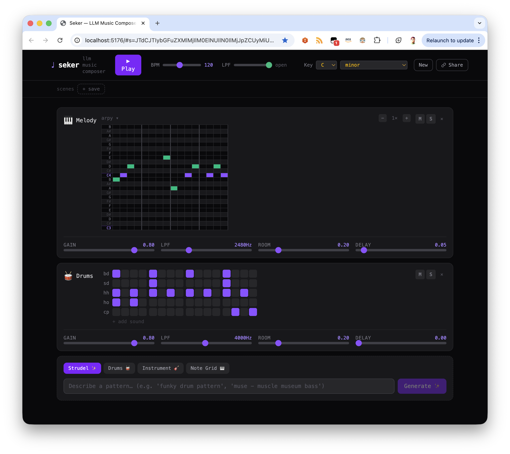

# Seker

**LLM-powered browser music composer.** Describe a pattern in plain English → Claude generates [Strudel](https://strudel.cc) code → layers stack into a live DAW-style session.



---

## Features

- **Natural language → music** — type *"funky drum pattern"* or *"jazzy bass line"*, Claude generates runnable Strudel code instantly
- **DAW-style lanes** — each generated pattern lives in its own lane with mute, solo, and delete controls
- **Live parameter control** — per-lane gain, low-pass filter, reverb, and delay sliders re-evaluate in real time (~80ms debounce)
- **Global LPF sweep** — master low-pass filter slider that caps all lanes simultaneously; sweep down to close the mix, up to open it
- **Scenes / snapshots** — save the current mix state (muted lanes, params, BPM, filter) as a numbered scene; jump between scenes with a single click or keyboard keys **1–9** for live performance transitions
- **Editable prompts** — click the `↺` prompt on any lane, edit the description, hit Regenerate to get a fresh pattern
- **Editable code** — click the green code block to hand-edit the Strudel expression directly
- **BPM control** — global tempo slider (60–200 BPM), updates live while playing
- **Shareable URLs** — entire session (lanes, prompts, params, BPM, scenes) encoded as base64url in the `#` hash; paste the URL to restore the session exactly

---

## Tech stack

| Layer | Library |
|---|---|
| UI | React 19 + Vite + Tailwind CSS v4 |
| Audio | [@strudel/web](https://www.npmjs.com/package/@strudel/web) |
| LLM | Claude Sonnet 4.6 via **AWS Bedrock** |
| Auth | AWS session credentials (injected at dev-start, no backend) |

---

## Getting started

### Prerequisites

- Node.js 18+
- AWS CLI configured with credentials that have Bedrock access (`bedrock:InvokeModel` on `us-west-2`)

### Install & run

```bash
git clone https://github.com/yortuc/seker.git
cd seker
npm install
npm run dev
```

`npm run dev` automatically calls `aws sts get-session-token` and writes temporary credentials to `.env.local` before starting Vite. The dev server opens at **http://localhost:5173**.

### First use

1. Click **▶ Play** — this initializes Web Audio and pre-warms the drum sample cache (~2 s)
2. Type a description in the bottom input and click **Generate ✨**
3. Add more lanes, adjust sliders, mute/solo to taste
4. Click **+ save** in the scene bar to snapshot the current mix; repeat for each stage of your set
5. Press **1–9** to jump between scenes live, or use the **LPF** slider to sweep the filter for build-ups
6. Click **Share** to copy a URL with the full session encoded in it

---

## Project structure

```
src/
  App.jsx                  — root state, URL sync, playback orchestration
  components/
    Header.jsx             — play/stop, BPM slider, global LPF, share button
    SceneBar.jsx           — scene save/load strip with keyboard shortcuts
    LaneList.jsx           — lane list + add-lane panel
    Lane.jsx               — single lane: code, prompt editor, sliders
    DrumLane.jsx           — 16-step drum sequencer grid
    NoteGridLane.jsx       — zoomable piano-roll note grid (Ctrl+scroll to zoom)
    GuitarTabLane.jsx      — guitar tab editor with chord shortcuts
    ParamSlider.jsx        — reusable labeled range input
    AddLanePanel.jsx       — prompt input → Claude → new lane
  hooks/
    useStrudel.js          — Strudel init, evaluate, hush, BPM, warm-up
    useLanes.js            — lane CRUD state
  utils/
    claude.js              — Bedrock ConverseCommand wrapper + system prompt
    strudel.js             — buildEvalCode() with mute/solo logic
    drumPattern.js         — drum grid → Strudel conversion
    noteGrid.js            — piano-roll grid → Strudel note() conversion
    guitarTab.js           — tab grid → Strudel note() conversion, chord shapes
    urlState.js            — base64url encode/decode for shareable URLs
scripts/
  get-aws-creds.js         — injects AWS session credentials into .env.local
dataset/                   — fine-tuning dataset pipeline (see below)
```

---

## Lane types

| Type | How to add | Description |
|---|---|---|
| **Strudel** | Generate ✨ | Claude writes raw Strudel code from a text prompt |
| **Drums** | Drums 🥁 | 16-step sequencer — click cells to toggle, add/remove sound rows |
| **Note Grid** | Note Grid 🎹 | Piano-roll editor — 2 octaves, 16 steps, drag to paint, Ctrl+scroll to zoom |
| **Instrument** | Instrument 🎸 | Guitar tab editor — 6 strings, chord shorthand (e.g. `022100`) |

---

## LLM Creativity for DSL Generation — Research Notes

How to make LLMs generate deep, creative, structurally rich outputs for domain-specific languages. Written in the context of Seker (Strudel music patterns) but applies equally to parametric CAD, GLSL shaders, architectural layout, and any creative DSL.

### The Core Problem: Capability-Knowledge Mismatch

LLMs trained on general code have *syntax knowledge* for a DSL — they've seen TidalCycles/Strudel patterns in training data — but lack *grounded domain knowledge* at the intersection of:
- What the DSL can express
- How a specific creative brief maps to concrete DSL constructs

The model fills this gap with statistically average patterns. This is why "funky drum pattern" gives you `s("bd sd hh bd")` every time, and "punk bassline influenced by Bach" gives you something that sounds neither punk nor Bach.

The same failure mode appears in:
- Parametric design (Grasshopper, OpenSCAD) — shapes are geometrically valid but compositionally shallow
- GLSL shaders — syntactically correct but visually generic
- Architectural layout DSLs — valid but uninteresting spatial arrangements

---

### Solution Stack (Layered — Each Adds Independently)

#### Layer 1 — Structured Chain-of-Thought
**Biggest single gain. Zero infrastructure. Implement first.**

Don't go description → DSL code in one shot. Force the model to reason through a typed intermediate specification before touching syntax.

Current Seker approach (two-step):
1. Description → music theory analysis JSON (key, notes, rhythm, character)
2. Analysis + description → Strudel code

What the research recommends enhancing this to:
```json
{
  "root": "C", "scale": "minor",
  "chord_progression": ["i", "VII", "VI", "VII"],
  "rhythmic_character": "driving eighth notes, pedal tone",
  "genre_primary": "punk",
  "genre_influences": ["Bach"],
  "compositional_techniques": [
    "chromatic descending bass line",
    "sequential motif repetition at different pitch levels",
    "root/fifth pedal tone ostinato"
  ],
  "register": "low",
  "strudel_functions_needed": ["note", "scale", "struct", "slow"]
}
```

The key: **making the model articulate compositional intent as a typed structure before writing code**. MuseCoco (2023) showed a 20% improvement in style-attribute control accuracy with this bridge.

**References:**
- MuseCoco: Text-to-symbolic music via attribute bridge — [arXiv:2306.00110](https://arxiv.org/abs/2306.00110)
- TOMI: Hierarchical planning for multi-track music generation — [arXiv:2506.23094](https://arxiv.org/abs/2506.23094)
- Planning-Driven Programming (98.2% HumanEval via plan-first pipeline) — [arXiv:2411.14503](https://arxiv.org/abs/2411.14503)
- CoComposer: Five-agent composition workflow (concept → harmony → melody → rhythm → arrangement) — [arXiv:2509.00132](https://arxiv.org/abs/2509.00132)

---

#### Layer 2 — Explicit Domain Knowledge in Prompts
**High impact. No infrastructure. 1–2 days.**

Don't trust the LLM to know what "Bach-influenced" means computationally — define it explicitly in the system prompt as DSL patterns:

```
"Bach-influenced" in Strudel means:
  - Chromatic descending bass: note("[c3,b2,bb2,a2,ab2,g2]").slow(2)
  - Sequential patterns: same motif transposed by scale degree
  - Regular harmonic rhythm: .struct("x ~ x ~")
  - Diminished passing chords between diatonic roots

"Punk bassline" in Strudel means:
  - Root/fifth pedal: note("[c2,g2]*2").s("bass")
  - Straight 8th-note feel, narrow register
  - Repetitive, driving, no swing
```

This *externalization of domain knowledge into the prompt* is the highest-leverage browser-compatible technique. Particularly powerful for cross-genre mixing: each genre/style gets a mini-dictionary of its computable musical fingerprints.

**Encoding "influenced by Bach" as computable features:**
1. Chromatic passing tones on weak beats
2. Descending bass lines using diminished 7th passing chords
3. Sequential (Rosalia) patterns — motif repeated at different pitch levels
4. Regular harmonic rhythm (1–2 chords/bar)
5. Voice-leading priority over harmonic boldness

**References:**
- MuseCoco attribute schema for style encoding — [arXiv:2306.00110](https://arxiv.org/abs/2306.00110)
- ImprovNet: Cross-genre style transfer via corruption-refinement — [arXiv:2502.04522](https://arxiv.org/abs/2502.04522)
- MuseMorphose: Bar-level style control with Transformer-VAE — [arXiv:2105.04090](https://arxiv.org/abs/2105.04090)

---

#### Layer 3 — Curated Example Library + Semantic RAG
**Very high impact. Browser-feasible. 1–2 weeks.**

Build a library of 100–200 richly annotated DSL examples. At generation time, semantically retrieve the 3–5 most relevant ones and inject them as few-shot examples.

Each entry in the library:
```json
{
  "code": "note(\"[c3,b2,bb2,a2] ~ [g2,f#2,f2,e2] ~\").s(\"bass\").slow(2)",
  "description": "Chromatic descending bass line over two bars, Baroque-style",
  "tags": ["bass", "chromatic", "baroque", "descending", "C minor"],
  "genre": "classical",
  "influences": ["Bach", "Handel"],
  "techniques": ["voice leading", "chromatic passing tones"],
  "key": "C minor",
  "rhythm": "whole note feel, one note per beat"
}
```

**Browser-feasible embedding**: `Xenova/all-MiniLM-L6-v2` via [Transformers.js](https://huggingface.co/docs/transformers.js) runs fully in-browser via WASM/ONNX (~25MB). Embed all pattern descriptions at load time, cosine-similarity search at generation time. No backend or vector DB needed for < 5,000 examples.

**Important**: Retrieve against the *Step 1 musical brief JSON*, not the raw user description. The plan makes a much better retrieval query than the natural language prompt.

ZK-Coder showed RAG taking DSL generation success from 20% to 87–97% for a specialized DSL (zero-knowledge proof code). The GEE-OPs paper demonstrated 20–30% improvement for geospatial DSL generation — a near-identical problem structure to Strudel.

**References:**
- ZK-Coder: RAG + repair for zero-knowledge proof DSL (20%→97%) — [arXiv:2509.11708](https://arxiv.org/abs/2509.11708)
- GEE-OPs: RAG knowledge base for geospatial DSL — [arXiv:2412.05587](https://arxiv.org/abs/2412.05587)
- PERC: Use plan-as-query for retrieval, not raw description — [arXiv:2412.12447](https://arxiv.org/abs/2412.12447)

---

#### Layer 4 — Execute → Validate → Repair Loop
**Medium-high impact. Browser-feasible (Strudel runs in browser). 2–3 days.**

```
Generate → Execute in Strudel → Catch errors → Feed back → Regenerate (max 3×)
```

Since Strudel evaluates in the browser, you can close the loop automatically:
1. Generate candidate code
2. Evaluate; capture runtime errors
3. If error: `"This code produced: {error}. Fix while maintaining: {musical_brief_json}"`
4. Repeat max 2–3 times

Self-Refine showed ~20% absolute improvement from a single self-critique pass with no additional training.

**References:**
- Self-Refine: ~20% gain from iterative self-critique — [arXiv:2303.17651](https://arxiv.org/abs/2303.17651)
- CRANE: Grammar constraints + free reasoning (scratch pad → constrained output) — [arXiv:2502.09061](https://arxiv.org/abs/2502.09061)
- AutoPLC: Four-stage pipeline with runtime validation for industrial DSL — [arXiv:2412.02410](https://arxiv.org/abs/2412.02410)

---

#### Layer 5 — Evolutionary Variation UI
**High UX impact. Browser-feasible. 1 week.**

Inspired by Picbreeder / AI Co-Artist for GLSL shader generation:
1. Generate 3–4 parallel variants of a pattern (different Step 1 samples)
2. User selects the most interesting one
3. LLM recombines: *"take the rhythmic character of pattern A and the harmonic movement of pattern B, generate 3 new variations"*

This creates a **human-guided evolutionary search** through the creative space. It's particularly effective because humans are good at recognizing creative quality even when they can't specify it in advance.

**References:**
- AI Co-Artist: Evolutionary LLM shader generation (Picbreeder-inspired) — [arXiv:2512.08951](https://arxiv.org/abs/2512.08951)
- Tidal MerzA: RL + affective alignment for TidalCycles — [arXiv:2409.07918](https://arxiv.org/abs/2409.07918)

---

#### Layer 6 — Fine-tuning a Small Model for Browser Inference

LoRA fine-tuning on a curated annotated example library (500+ entries). The research shows 9–32% accuracy improvements over zero-shot for DSL generation tasks. A fine-tuned 1.5B model outperforms a generic 3B on a narrow domain like this.

**Target model:** `Qwen2.5-Coder-1.5B-Instruct` — strong code model, runs in-browser via [WebLLM](https://webllm.mlc.ai/) at ~0.9 GB download, ~45 tok/s on a modern GPU with WebGPU.

**Post-training techniques:**
- **SFT** — teach the model the Strudel DSL idioms from the curated dataset
- **DPO** — preference pairs (chosen: uses euclid/modulation/probability, rejected: simple patterns) to push toward creative outputs
- **KTO** — simpler alternative: binary good/bad labels; good = runs + uses ≥3 creative features

**Browser deployment pipeline:**
```
Fine-tune with LoRA + SFT/DPO
  → merge LoRA adapter into base weights
  → mlc_llm convert_weight --quantization q4f16_1
  → upload MLC weights to HuggingFace (free hosting)
  → load in browser via @mlc-ai/web-llm
```

Zero marginal cost at inference time — runs entirely on the user's GPU. See `dataset/` for the data pipeline.

**References:**
- HNote: LoRA fine-tune on folk music notation (LLaMA-3.1-8B, 82.5% syntactic correctness) — [arXiv:2509.25694](https://arxiv.org/abs/2509.25694)
- ImprovNet: Corruption-refinement training for cross-genre style transfer — [arXiv:2502.04522](https://arxiv.org/abs/2502.04522)
- DPO: Direct Preference Optimization — [arXiv:2305.18290](https://arxiv.org/abs/2305.18290)

---

### The Quality Ceiling

Research indicates that prompting alone caps at roughly **40–60% user satisfaction for complex multi-genre briefs**. The gap is not prompt engineering — it's the model's implicit domain theory. Layers 1–4 push toward this ceiling. Layer 6 raises it.

The most tractable path without fine-tuning: **encode domain knowledge explicitly in prompts**. Rather than relying on the model to know what "Bach-influenced" means computationally, define it. This externalization of domain expertise is the highest-leverage browser-compatible technique.

---

### Implementation Priority

| # | What | Expected gain | Effort |
|---|---|---|---|
| 1 | Richer Step 1 brief (genre-mixing logic, compositional techniques field) | High | 1 day |
| 2 | Genre knowledge dictionary injected per-brief into system prompt | High | 1–2 days |
| 3 | Execute → validate → repair loop (2 iterations max) | Medium-High | 2–3 days |
| 4 | Curated pattern library + MiniLM browser RAG | Very High | 1–2 weeks |
| 5 | Evolutionary variation UI (3 variants → user pick → recombine) | High (UX) | 1 week |
| 6 | LoRA fine-tuning (requires backend) | Highest | Future |

---

### Cross-Domain Applicability

The pattern is consistent across all creative DSL domains: **plan → retrieve similar examples → generate → validate → repair**. The domain-specific part is the intermediate representation (the "musical brief" equivalent) and the validation rules.

| Domain | DSL | Analogous Technique |
|---|---|---|
| Music composition | Strudel / TidalCycles | Genre dictionaries, MuseCoco attribute bridge |
| Parametric design | Grasshopper, OpenSCAD | Shape grammar dictionaries, CAD-Coder two-stage pipeline |
| Shader generation | GLSL | AI Co-Artist evolutionary approach |
| Architectural layout | Custom DSLs | APT multi-modal CoT with memory/reflection |
| Industrial control | PLC structured text | AutoPLC four-stage plan+retrieve+validate |
| Geospatial analysis | Google Earth Engine | GEE-OPs AST-based knowledge base |

---

### Key References

| Paper | arXiv | Topic |
|---|---|---|
| MuseCoco | [2306.00110](https://arxiv.org/abs/2306.00110) | Text → attribute → symbolic music (direct parallel) |
| TOMI | [2506.23094](https://arxiv.org/abs/2506.23094) | Hierarchical LLM planning for multi-track music |
| CoComposer | [2509.00132](https://arxiv.org/abs/2509.00132) | Five-agent music composition workflow |
| ImprovNet | [2502.04522](https://arxiv.org/abs/2502.04522) | Jazz/classical cross-genre style transfer (79% recognizable) |
| MuseMorphose | [2105.04090](https://arxiv.org/abs/2105.04090) | Fine-grained style control via Transformer-VAE |
| Tidal MerzA | [2409.07918](https://arxiv.org/abs/2409.07918) | Only published ML paper on TidalCycles generation |
| Self-Refine | [2303.17651](https://arxiv.org/abs/2303.17651) | ~20% gain from iterative self-critique, no training |
| ZK-Coder | [2509.11708](https://arxiv.org/abs/2509.11708) | RAG + repair: 20%→97% for specialized DSL |
| GEE-OPs | [2412.05587](https://arxiv.org/abs/2412.05587) | RAG knowledge base for geospatial DSL |
| PERC | [2412.12447](https://arxiv.org/abs/2412.12447) | Plan-as-query retrieval strategy |
| CRANE | [2502.09061](https://arxiv.org/abs/2502.09061) | Grammar constraints without hurting reasoning |
| Planning-Driven Programming | [2411.14503](https://arxiv.org/abs/2411.14503) | Plan-first pipeline (98.2% HumanEval) |
| AutoPLC | [2412.02410](https://arxiv.org/abs/2412.02410) | Four-stage plan+RAG+validate for industrial DSL |
| AI Co-Artist | [2512.08951](https://arxiv.org/abs/2512.08951) | Evolutionary LLM generation for GLSL shaders |
| HNote | [2509.25694](https://arxiv.org/abs/2509.25694) | LoRA fine-tune on folk music notation |

---

## Dataset pipeline

The `dataset/` directory contains a Python pipeline for building a fine-tuning dataset of (prompt → Strudel code) pairs. Used for Layer 6 fine-tuning above.

### Setup

```bash
cd dataset
pip install -r requirements.txt
# AWS credentials with Bedrock access must be configured (same as the app)
```

### Scripts

| Script | What it does |
|---|---|
| `scrape.py` | Fetches Strudel docs pages, extracts code blocks via BeautifulSoup |
| `generate.py` | Generates synthetic (prompt → code) pairs using Claude on Bedrock |
| `augment.py` | Writes natural-language descriptions for scraped code (code → prompt) |
| `score.py` | Scores examples on 35 creativity features; filters low-quality ones |
| `build.py` | Deduplicates, filters by quality score, splits 90/10, writes JSONL |
| `config.py` | System prompt, 68 generation prompts, scoring weights |

### Run the full pipeline

```bash
python scrape.py                 # ~202 examples from Strudel docs
python generate.py               # ~68 synthetic examples (all prompts in config.py)
python augment.py                # writes prompts for the 30 quality scraped examples
python build.py                  # assembles → output/train.jsonl + output/val.jsonl
```

Add more prompts to `GENERATION_PROMPTS` in `config.py` to scale up. `generate.py` checkpoints progress and can be resumed.

### Output format

Final JSONL uses the standard chat message format for SFT:

```json
{
  "messages": [
    {"role": "system",    "content": "You are an expert Strudel live-coder..."},
    {"role": "user",      "content": "funky acid bassline with filter sweep"},
    {"role": "assistant", "content": "note(\"c2 ~ eb2 ~ g2 bb2 ~\").s(\"sawtooth\").lpf(sine.range(400,2000))"}
  ]
}
```

### Quality scoring

Examples are scored on 35 features weighted by creativity value:

| Feature | Score | Why |
|---|---|---|
| `euclid`, `polymeter`, `polyrhythm` | +3–4 | Rhythmic complexity |
| `perlin`, `randcat` | +3 | Generative variation |
| `sometimes`, `rarely`, `every` | +2 | Probability/evolution |
| `sine`, `rand`, `.range()` | +2 | Modulation |
| `.room()`, `.delay()`, `.lpf()` | +1 | Effects |
| `stack`, `cat` | +1 | Multi-voice structure |

Default threshold: `MIN_QUALITY_SCORE = 6`. Adjust in `config.py`.

---

## Turkish Maqam Scales

Seker supports Turkish makam (maqam) scales alongside standard Western scales. Because Strudel operates in 12-tone equal temperament (12-TET), maqams fall into two categories.

### Supported — 12-TET compatible

These maqams map cleanly onto standard semitones and are fully supported today. They are available in the Key selector in the header.

| Maqam | Semitone intervals | Character |
|---|---|---|
| Nihavend | 0 2 3 5 7 8 11 | Melancholic, close to harmonic minor |
| Hicaz | 0 1 4 5 7 8 10 | Tense, exotic — the augmented 2nd is its signature |
| Hicazkar | 0 1 4 5 7 8 11 | Hicaz with a leading tone, more resolved |
| Kürdî | 0 1 3 5 7 8 10 | Dark and low, similar to Phrygian |

**Strudel note sequences** (root C, for reference):
```
Nihavend  → note("c d eb f g ab b")
Hicaz     → note("c db e f g ab bb")
Hicazkar  → note("c db e f g ab b")
Kürdî     → note("c db eb f g ab bb")
```

### Not yet supported — microtonal

Several important maqams use **quarter tones** (~50 cents) that fall between standard semitones and cannot be represented accurately in 12-TET.

| Maqam | Microtonal interval | Notes |
|---|---|---|
| Rast | 3rd ≈ 350¢, 7th ≈ 1050¢ | Foundational maqam, quarter-flat 3rd and 7th |
| Uşşak / Bayatı | 3rd ≈ 250¢ | Quarter-flat minor 3rd |
| Saba | Multiple quarter tones | Highly distinctive, difficult to approximate |
| Segah | Multiple quarter tones | Built on a quarter tone as the tonic |

Microtonal support is technically possible in Strudel via `freq()` with computed Hz values, but requires a different generation approach and is planned for a future release.

---

## Available sounds

Patterns are generated using only sounds that are guaranteed to load from the [TidalCycles Dirt-Samples](https://github.com/tidalcycles/Dirt-Samples) pack:

| Category | Sounds |
|---|---|
| Drums | `bd` `sd` `hh` `ho` `cp` `mt` `ht` `lt` `rim` `cb` |
| Melodic samples | `arpy` `pluck` `bass` `moog` `juno` `gtr` `jazz` `sitar` |
| Synths | `sawtooth` `square` `triangle` `sine` `supersaw` `pulse` |
